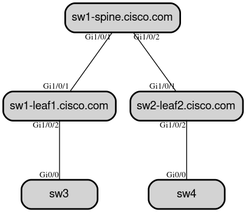

# Network Discovery Map with LLDP
In this demo we build a topology map of network switches as code using graphviz and the napalm collection.

## Dependencies 
This demo requires the following:
 1. switches that are able to enable LLDP. My switches are running in Cisco Modelinb Labs (cml)
 ~~~
 conf t
 lldp run
 ~~~
 2. In addition to collections for your switches the execution environment needs the napalm collection and the graphviz python application to create the `.png` files for the map

EE files:
 ~~~
 $ cat bindep.txt
graphviz [platform:rpm]

 $ cat requirements.yml
 - name: napalm.napalm
~~~
 3. Fork this repo or create your own to save and view the network map files
 
 ## Demo

 ### Please see the playbook `cisco_lldp_topo.yml`

 You must create credentials or extra variables to authenticate to your github repository. Make these credentials availble for your job-template that manages the playbook cisco_lldp_topo.yml. This will allow you to push your updated .png files back to your new repo or forked repo.

 ~~~
 ---
- name: Gather facts
  hosts: cml_catalyst
  gather_facts: no

  roles:
    - { role: napalm_get_facts , filter: ['facts', 'lldp_neighbors'] } 

- name: Generate LLDP topology graph
  hosts: localhost
  gather_facts: no

  pre_tasks:
  - name: Retrieve a repository from a distant location and make it available to the local EE
    ansible.scm.git_retrieve:
      origin:
        url: "https://github.com/andubiel/ansible_cml_demos.git"
      parent_directory: /tmp
      branch:
        name: main
        duplicate_detection: no
    register: repository
    when: inventory_hostname == 'localhost'

  roles:
    - cisco_lldp_topo
  
  tasks:

  - name: Publish the changes
    ansible.scm.git_publish:
      path: "{{ repository['path'] }}"
      token: "{{ token }}"
      user:
        name: "{{ git_user }}"
        email: "{{ email }}"
    when: inventory_hostname == 'localhost'
~~~

### Run the job-template (playbook)
When you run the playbook it will invoke the `role: napalm_get_facts` and create a new .png file with a timestamp.

The files can be viewed in lldp_graphviz/network/maps

~~~
ls lldp_graphviz/network_maps/
lldp_topo_2024-07-31_19-03-49.png  lldp_topo_2024-07-31_21-41-34.png
~~~

 